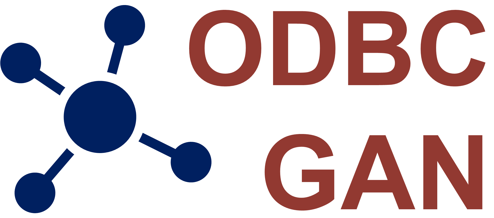

# ODBC-GAN: An integrated GAN model for outlier detection and batch correction in multi-sample and multi-modal transcriptomics
We propose a Generative Adversarial Networks called <b>ODBC-GAN</b>  (<b>O</b>utlier <b>D</b>etection and <b>B</b>atch <b>C</b>orrection <b>GAN</b>), which can detect different types of outlier observations (cells or spots), detect the subtypes of outliers further, and correct batch effects among multi-sample datasets. ODBC-GAN has two main modes (SC and SRT), which can be suitable for single-cell or spatially resolved transcriptomics dataset. ODBC-GAN in SC mode can solve these problem by gene expression of cells, and SRT mode combines gene expression, position information, and slice image of spots.

 

 

## Applicable tasks
### Outlier detection
- Detect outlier cells on single-cell datasets.
- Classify subtypes of the outlier cells.
- Detect outlier spots on spatial transcriptomics datasets.
- Classify subtypes of the outlier spots.

### Batch correction
- Correct the batch effects among single-cell datasets.
- Correct the batch effects among vertical slice spatial transcriptomics datasets.
- Correct the batch effects among horizontal slice spatial transcriptomics datasets.

## Advantages
- Superior performance.
- Integrated outlier detection and batch correction in multi-sample transcriptomic data.
- Avoid negative values after batch correction.
- Keep the original data space after batch correction.
- Applicability to both scRNA-seq and SRT.

## Tested environment
- CPU: Intel(R) Xeon(R) Platinum 8255C CPU @ 2.50GHz
- CPU Memory: 256 GB
- GPU: NVIDIA GeForce RTX 3090
- GPU Memory: 24 GB
- System: Ubuntu 20.04.5 LTS
- Python: 3.9.15

## Source codes
All the source codes of ODBC-GAN are available on [ODBC-GAN](https://github.com/Catchxu/ODBC-GAN).

## Contributors
- [Kaichen Xu](https://github.com/Catchxu): lead developer, initial ODBC-GAN conception.
- [Kainan Liu](https://github.com/LucaFederer): developer, diverse contributions.
- Xiaobo Sun & lab: enabling guidance, support and environment.

## Citation
Coming soon.
